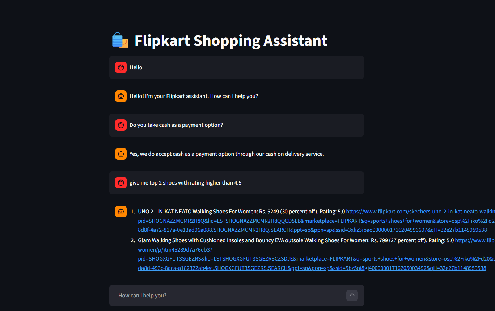

# 🛍️ Flipkart Smart Shopping Assistant
**A Generative AI RAG Chatbot using Llama 3.3, Groq, and Semantic Routing.**

This project is an intelligent e-commerce chatbot designed to handle customer queries with precision. By identifying user intent, it switches between a knowledge base for policies (FAQ) and a live product database (SQL) to provide real-time, accurate responses.

---

## 🚀 Key Features
- **Intent-Based Routing**: Uses `semantic-router` to distinguish between general talk, policy questions, and product searches.
- **RAG for FAQs**: Leverages **ChromaDB** vector store to retrieve information about shipping, returns, and payments.
- **Text-to-SQL Search**: Dynamically generates and executes secure SQL queries on a SQLite database to find products based on user criteria (price, brand, rating).
- **Security First**: Implements a SQL validation layer to prevent unauthorized database commands.
- **Rich UI**: Interactive Streamlit interface featuring product cards with images, pricing, and direct links.

---

## 🏗️ Architecture
The system utilizes a modular RAG (Retrieval-Augmented Generation) flow:


1. **User Input**: Query is received via Streamlit.
2. **Router**: `HuggingFaceEncoder` transforms the text to identify the route (FAQ, SQL, or Chitchat).
3. **FAQ Path**: Similarity search in **ChromaDB** retrieves relevant policy context.
4. **SQL Path**: LLM generates a SQL query -> **Validation Layer** checks safety -> Results fetched from **SQLite**.
5. **Synthesis**: LLM (Llama 3.3 via Groq) combines data into a natural response.

---

## 📂 Project Structure
```text
├── app/
│   ├── main.py             # Streamlit UI & Core Application Logic
│   ├── router.py           # Semantic Router & Intent Classification
│   ├── faq.py              # ChromaDB Ingestion & Vector Search logic
│   ├── sql.py              # Text-to-SQL generation & Validation
│   ├── db.sqlite           # SQLite Database containing product data
│   ├── requirements.txt    # List of Python dependencies
│   └── resources/
│       └── faq_data.csv    # Source file for customer policies
└── web-scraping/           # Scripts used to collect data from Flipkart
```
---

## Screenshot


---

## Architecture


### Set-up & Execution

1. Run the following command to install all dependencies. 

    ```bash
    pip install -r app/requirements.txt
    ```

1. Inside app folder, create a .env file with your GROQ credentials as follows:
    ```text
    GROQ_MODEL=<Add the model name, e.g. llama-3.3-70b-versatile>
    GROQ_API_KEY=<Add your groq api key here>
    ```

1. Run the streamlit app by running the following command.

    ```bash
    streamlit run app/main.py
    ```

